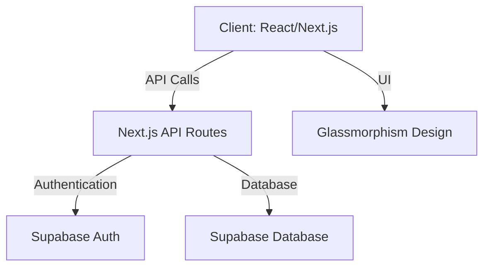

# Architecture Document

## 1. System Overview
The **College Attendance System** is a React application built using Next.js APIs. It follows a **client-server architecture** with Supabase as the backend for authentication and database management.

---

## 2. Component Diagram

---

## 3. Technology Stack
| Layer          | Technology Stack                          |
|----------------|-------------------------------------------|
| Frontend       | React, Next.js, Tailwind CSS              |
| Backend        | Next.js API Routes                        |
| Authentication | Supabase Auth                             |
| Database       | Supabase PostgreSQL                       |
| Deployment     | Vercel                                   |

---

## 4. Data Flow
1. **User Authentication**:
   - User logs in via Supabase Auth.
   - Supabase returns a JWT token for session management.

2. **Attendance Marking**:
   - Faculty selects a class and marks attendance.
   - Data is sent to Supabase via Next.js API routes.

3. **Report Generation**:
   - Staff/Admin requests attendance reports.
   - Next.js API fetches data from Supabase and generates reports.

---

## 5. Database Schema
### 5.1 Tables
| Table Name   | Description                          | Fields                                                                 |
|--------------|--------------------------------------|------------------------------------------------------------------------|
| Users        | User accounts                        | `id`, `name`, `email`, `role`, `created_at`                            |
| Courses      | College courses                      | `id`, `name`, `code`, `faculty_id`, `created_at`                       |
| Classes      | Class sessions                       | `id`, `course_id`, `date`, `start_time`, `end_time`, `created_at`      |
| Attendance   | Attendance records                   | `id`, `class_id`, `student_id`, `status`, `marked_by`, `created_at`    |

---

## 6. API Endpoints
| Endpoint                     | Method | Description                          |
|------------------------------|--------|--------------------------------------|
| `/api/auth/login`            | POST   | User login                          |
| `/api/auth/logout`           | POST   | User logout                         |
| `/api/attendance/mark`       | POST   | Mark attendance for a student       |
| `/api/attendance/report`     | GET    | Generate attendance report          |
| `/api/courses`               | GET    | List all courses                    |
| `/api/classes`               | GET    | List all classes for a course       |

---

## 7. UI Components
| Component               | Description                          |
|------------------------|--------------------------------------|
| Login Page             | User authentication                  |
| Dashboard              | Role-based dashboard                 |
| Attendance Marking     | Faculty marks attendance             |
| Attendance Report      | Generate and view reports            |
| Profile Management     | Update user profile                  |

---

## 8. Deployment Strategy
1. **Frontend**: Deploy React/Next.js app on Vercel.
2. **Backend**: Next.js API routes hosted on Vercel.
3. **Database**: Supabase PostgreSQL.
4. **Environment Variables**: Store Supabase credentials in Vercel environment variables.